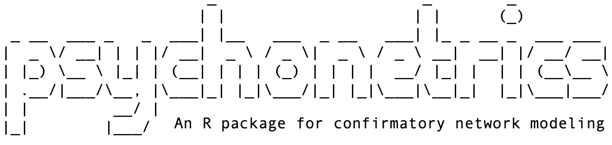
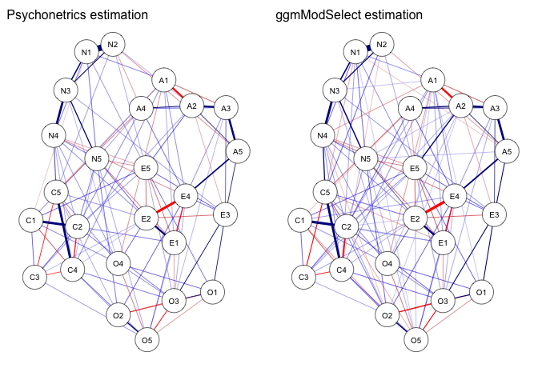
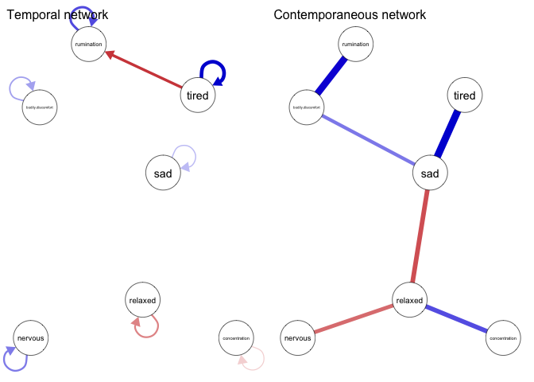

================
Sacha Epskamp

### Table of contents

-   [Introduction](#introduction)
-   [Installation](#installation)
-   [Gaussian graphical model](#gaussian-graphical-model)
    -   [Obtaining a network from bootnet](#obtaining-a-network-from-bootnet)
    -   [Plotting the network](#plotting-the-network)
    -   [Confirmatory fit](#confirmatory-fit)
    -   [Multi-group analysis](#multi-group%20analysis)
-   [Latent network modeling (CFA)](#latent-network-modeling-cfa)
-   [Residual network modeling (SEM)](#residual-network-modeling-sem)
-   [Graphical vector-autoregression](#graphical-vector-autoregression)

Introduction
============

The R package `psychonetrics` is designed to be a package for confirmatory multi-group network analysis. The goal of the package is to provide relatively fast maximum likelihood estimators for the following modeling frameworks:

-   Gaussian graphical model - `ggm()`
-   Residual network model- `rnm()`
-   Latent network model - `lnm()`
-   Graphical vector auto-regression for *n* = 1 time-series - `gvar()`
-   Graphical vector auto-regression for panel data - Not yet implemented
-   Ising model - Not yet implemented
-   Fused latent and graphical IRT (Chen et al. 2018) - Not yet implemented

Note that this version is highly unstable, and that all reported values such as standard errors, *p*-values and modification indices, have not yet been thoroughly validated (please let me know if you wish to help out with this).

Installation
============

The package can be installed from Github:

``` r
library("devtools")
install_github("sachaepskamp/psychonetrics")
```

and subsequently loaded as usual. I will also load the `dplyr` package to obtain the useful pipe operator `%>%`:

``` r
library("psychonetrics")
library("dplyr")
```

Gaussian graphical model
========================

Let's take the `bfi` dataset, but leave the first 1000 observations out to later test our model on:

``` r
library("psych")
# Load data:
data(bfi)

# Define variables:
vars <- names(bfi)[1:25]

# Let's use the first 1000 rows as test data:
testData <- bfi[1:1000, ]

# And the rest as training data:
trainingData <- bfi[-(1:1000), ]
```

This data does not have a lot of missing data:

``` r
mean(is.na(trainingData))
```

    ## [1] 0.009265873

So we can use the faster maximum likelihood estimation (especially given this large sample size), which uses listwise missing data deletion (set `estimator = "FIML"` for full information maximum likelihood instead).

The first step in using psychonetrics is to form a psychonetrics model:

``` r
model <- ggm(trainingData, vars = vars, omega = "full")
```

This creates an *unevaluated* model. The `omega` argument corresponds with the partial correlation matrix, using the following modeling framework for the GGM (Epskamp, Rhemtulla, and Borsboom 2017):

-   **μ** = **μ**
-   **Σ** = **Δ**(**I**−**Ω**)<sup>−1</sup>**Δ**

in which **Σ** represents the modeled variance--covariance matrix and **μ** the mean structure. The diagonal matrix **Δ** is a scaling matrix that is added by default (argument `delta`). This framework is especially useful in multi-group analysis, as it allows to fix partial correlations in **Ω** across groups while keeping the scaling unconstrained. We can use the `omega` argument in the `ggm` function to specify a network structure by assigning it an adjacency matrix (a matrix of zeroes and ones). The defaults `model = "full"` and `model = "empty"` instead simply create a fully connected network model or an empty network model.

The psychonetrics model is a rich model that contains a lot of information. For example, it stores the required summary statistics and fit functions (e.g,. gradient and Hessian), and even keeps a logbook of all changes made including time-stamps and `sessionInfo` information. Many other functions in psychonetrics will update the model in some way, or use the model to obtain some information to print.

The model, however, has not yet been evaluated. to do this, we need to apply the `runmodels` function:

``` r
model <- model %>% runmodel
```

    ## Estimating baseline model...

    ## Estimating model...

    ## Computing modification indices...

This will compute the baseline and saturated model as well, which are stored in the object so they don't have to be computed again. We can now print the model to obtain some information:

``` r
model
```

    ##                         _                      _        _          
    ##                        | |                    | |      (_)         
    ##    _ __  ___ _   _  ___| |__   ___  _ __   ___| |_ _ __ _  ___ ___ 
    ##   |  _ \/ __| | | |/ __|  _ \ / _ \|  _ \ / _ \ __|  __| |/ __/ __|
    ##   | |_) \__ \ |_| | (__| | | | (_) | | | |  __/ |_| |  | | (__\__ \
    ##   | .__/|___/\__, |\___|_| |_|\___/|_| |_|\___|\__|_|  |_|\___|___/
    ##   | |         __/ |                                                
    ##   |_|        |___/                                                 
    ##  
    ## 
    ## General: 
    ##  - psychonetrics version: 0.1.2 
    ##  - Model last edited at: 2019-03-06 10:02:51
    ## 
    ## Sample: 
    ##  - Number of cases: 1562 
    ##  - Number of groups: 1 
    ##  - Number of observed summary statistics: 350
    ## 
    ## Model: 
    ##  - model used: Gaussian graphical model (GGM) 
    ##  - Number of parameters: 350
    ## 
    ## Estimation: 
    ##  - Optimizer used: nlminb 
    ##  - Estimator used: Maximum likelihood estimation (ML) 
    ##  - Message: both X-convergence and relative convergence (5)
    ## 
    ## Fit: 
    ##  - Model Fit Test Statistic: < 0.0001 
    ##  - Degrees of freedom: 0 
    ##  - p-value (Chi-square): 1
    ## 
    ## Tips: 
    ##  - Use 'psychonetrics::compare' to compare psychonetrics models 
    ##  - Use 'psychonetrics::fit' to inspect model fit 
    ##  - Use 'psychonetrics::parameters' to inspect model parameters 
    ##  - Use 'psychonetrics::MIs' to inspect modification indices

Since the model is saturated, this is not that interesting. Let's check the estimated parameters:

``` r
model %>% parameters
```

    ## 
    ##  Parameters for group 1
  
  			(...)
  			
    ## 
    ##  -  omega (symmetric) 
    ##  var1 op var2      est    se        p row col par
    ##    A2 --   A1    -0.23 0.024 < 0.0001   2   1  26
    ##    A3 --   A1    -0.16 0.025 < 0.0001   3   1  27
  
    			(...)
  
    ##    N4 --   A5   -0.015 0.025     0.56  19   5 129
    ##    N5 --   A5    0.055 0.025    0.029  20   5 130
    ##    O1 --   A5 -0.00093 0.025     0.97  21   5 131
    ##    O2 --   A5    0.015 0.025     0.54  22   5 132

  			(...)

The edge *O1 -- A5* is estimated to be near zero, so let's try removing this edge:

``` r
# fix the parameter to zero:
model2 <- model %>% fixpar("omega", "O1", "A5", value=0)
```

    ## Fixed 1 parameters!

``` r
# Evaluate the new model:
model2 <- model2 %>% runmodel
```

    ## Estimating model...

    ## Computing modification indices...

We can compare the two models:

``` r
compare(model, model2)
```

    ##    model DF       AIC       BIC    Chisq Chisq_diff DF_diff p_value
    ##  Model 1  0 125975.19 127848.99 < 0.0001                           
    ##  Model 2  1 125973.19 127841.64   0.0013     0.0013       1    0.97
    ## 
    ## Note: Chi-square difference test assumes models are nested.

Removing the edge improved our model. The *prune* function can be used to automatically and recursively remove any parameter that is not significant at some *α* level

``` r
prunedmodel <- model2 %>% prune(alpha = 0.01, recursive = TRUE)
```

    ## Clearing 199 parameters!

    ## Estimating model...

    ## Computing modification indices...

    ## Clearing 6 parameters!

    ## Estimating model...

    ## Computing modification indices...

``` r
compare(saturated = model, nearsaturated = model2, pruned = prunedmodel)
```

    ##          model  DF       AIC       BIC    Chisq Chisq_diff DF_diff
    ##      saturated   0 125975.19 127848.99 < 0.0001                   
    ##  nearsaturated   1 125973.19 127841.64   0.0013     0.0013       1
    ##         pruned 206 126082.68 126853.61   519.49     519.48     205
    ##   p_value
    ##          
    ##      0.97
    ##  < 0.0001
    ## 
    ## Note: Chi-square difference test assumes models are nested.

The pruned model has a much better BIC, although the comparison with regard to AIC and *χ*<sup>2</sup> is less strong in favor of this pruned model. We can also look at the modification indices:

``` r
prunedmodel %>% MIs
```

    ## 
    ## Top 10 modification indices:
    ## 
    ##  var1 op var2 est    mi      pmi epc matrix row col group
    ##    C1 --   A1   0 19.72 < 0.0001      omega   6   1     1
    ##    C2 --   A1   0 14.94  0.00011      omega   7   1     1
    ##    E5 --   C2   0 14.59  0.00013      omega  15   7     1
    ##    N5 --   A4   0 13.64  0.00022      omega  20   4     1
    ##    O4 --   N4   0 11.97  0.00054      omega  24  19     1
    ##    O5 --   N5   0 11.70  0.00062      omega  25  20     1
    ##    E5 --   C5   0 11.59  0.00066      omega  15  10     1
    ##    C5 --   A1   0 11.44  0.00072      omega  10   1     1
    ##    O5 --   N1   0 10.84  0.00099      omega  25  16     1
    ##    O5 --   E2   0 10.57   0.0011      omega  25  12     1

By default, only the top 10 modification indices are shown, but this can be changed with `MIs(all = TRUE)`. We can try to add one edge to the model:

``` r
# Add an edge and evaluate:
model3 <- prunedmodel %>% freepar("omega","A1","C1") %>% runmodel
```

    ## Freed 1 parameters!

    ## Estimating model...

    ## Computing modification indices...

``` r
# compare:
compare(saturated = model, nearsaturated = model2,
        pruned = prunedmodel, lastmodel = model3)
```

    ##          model  DF       AIC       BIC    Chisq Chisq_diff DF_diff
    ##      saturated   0 125975.19 127848.99 < 0.0001                   
    ##  nearsaturated   1 125973.19 127841.64   0.0013     0.0013       1
    ##      lastmodel 205 126064.95 126841.24   499.76     499.76     204
    ##         pruned 206 126082.68 126853.61   519.49      19.73       1
    ##   p_value
    ##          
    ##      0.97
    ##  < 0.0001
    ##  < 0.0001
    ## 
    ## Note: Chi-square difference test assumes models are nested.

We can see that this model fits better. There is an automated function in *psychonetrics* that adds edges according to modification indices at a given level of *α*, which will stop searching by default if BIC is no longer increased:

``` r
# Stepup search:
model_stepup <- model3 %>% stepup

# compare:
compare(saturated = model, nearsaturated = model2, pruned = prunedmodel, oneMIadded = model3, stepup = model_stepup)
```

    ##          model  DF       AIC       BIC    Chisq Chisq_diff DF_diff
    ##      saturated   0 125975.19 127848.99 < 0.0001                   
    ##  nearsaturated   1 125973.19 127841.64   0.0013     0.0013       1
    ##         stepup 192 125954.11 126800.00   362.92     362.92     191
    ##     oneMIadded 205 126064.95 126841.24   499.76     136.84      13
    ##         pruned 206 126082.68 126853.61   519.49      19.73       1
    ##   p_value
    ##          
    ##      0.97
    ##  < 0.0001
    ##  < 0.0001
    ##  < 0.0001
    ## 
    ## Note: Chi-square difference test assumes models are nested.

Which leads to a best fitting model according to all indices.. This leads to an efficient estimation algorithm by combining the two. For example, `model %>% runmodel %>% prune %>% stepup` will estimate a model structure relatively fast, while `model %>% runmodel %>% stepup %>% prune` will be slower but generally more conservative. all these model modifications we made are actually stored in the *psychonetrics* object. For example:

``` r
data.frame(
  timestamp = sapply(model_stepup@log,function(x)as.character(x@time)),
  event = sapply(model_stepup@log,function(x)as.character(x@event))
)
```


Obtaining a network from bootnet
--------------------------------

The *psychonetrics* is not intended, however, to replace exploratory model search functions. Instead, the bootnet package provides more algorithms that may be faster. For example, we could also use *qgraph*'s `ggmModSelect` function:

``` r
library("bootnet")
net <- estimateNetwork(trainingData[,vars], default = "ggmModSelect", verbose = FALSE)
```

We can transform this into a psychonetrics object and refit the model:

``` r
model_frombootnet <- frombootnet(net) %>% runmodel
```

    ## Estimating baseline model...

    ## Estimating model...

    ## Computing modification indices...

And compare it to our model:

``` r
compare(ggmModSelect = model_frombootnet, psychonetrics = model_stepup)
```

    ##          model  DF       AIC       BIC  Chisq Chisq_diff DF_diff  p_value
    ##   ggmModSelect 173 125905.33 126852.94 276.14                            
    ##  psychonetrics 192 125954.11 126800.00 362.92      86.78      19 < 0.0001
    ## 
    ## Note: Chi-square difference test assumes models are nested.

Which results in a comparable fit.

Plotting the network
--------------------

The package does not contain plotting methods yet, but does return the estimated network structure, which we can plot:

``` r
library("qgraph")
stepup_net <- model_stepup@modelmatrices$`1`$omega
bootnet_net <- model_frombootnet@modelmatrices$`1`$omega
L <- averageLayout(as.matrix(stepup_net), as.matrix(bootnet_net))
layout(t(1:2))
qgraph(stepup_net, labels = vars, theme = "colorblind", 
       title = "Psychonetrics estimation", layout = L)
qgraph(bootnet_net, labels = vars, theme = "colorblind", 
       title = "ggmModSelect estimation", layout = L)
```



Confirmatory fit
----------------

Now let's take our model (let's use only the psychonetrics estimated model) and fit it to the test data:

``` r
adjacency <- 1*(model_stepup@modelmatrices$`1`$omega!=0)
confirmatory <- ggm(testData, vars = vars, omega = adjacency)
confirmatory <- confirmatory %>% runmodel
```

    ## Estimating baseline model...

    ## Estimating model...

    ## Computing modification indices...

The model shows very good fit to the test data:

``` r
confirmatory %>% fit
```

    ##            Measure     Value
    ##               logl -35112.68
    ##  unrestricted.logl -34874.93
    ##      baseline.logl -38155.76
    ##               nvar        25
    ##               nobs       350
    ##               npar       158
    ##                 df       192
    ##          objective     34.40
    ##              chisq    475.49
    ##             pvalue        ~0
    ##     baseline.chisq   6561.66
    ##        baseline.df       300
    ##    baseline.pvalue        ~0
    ##                nfi      0.93
    ##               pnfi      0.59
    ##                tli      0.93
    ##               nnfi      0.93
    ##                rfi      0.89
    ##                ifi      0.96
    ##                rni      0.95
    ##                cfi      0.95
    ##              rmsea     0.041
    ##     rmsea.ci.lower     0.036
    ##     rmsea.ci.upper     0.046
    ##       rmsea.pvalue       1.0
    ##             aic.ll  70541.36
    ##            aic.ll2  70611.63
    ##              aic.x     91.49
    ##             aic.x2    791.49
    ##                bic  71295.50
    ##               bic2  70793.73
    ##               ebic  71804.09
    ##         ebicTuning      0.25

Multi-group analysis
--------------------

We can create a multi-group model using the `groups` argument (see also Kan, Maas, and Levine (2019)). Let's fit our model to both groups separately:

``` r
groupmodel <- ggm(trainingData, vars = vars, omega = adjacency, groups = "gender") %>% runmodel
```

This model fits very well:

``` r
groupmodel %>% fit
```

    ##            Measure     Value
    ##               logl -62572.95
    ##  unrestricted.logl -62243.20
    ##      baseline.logl -68447.73
    ##               nvar        25
    ##               nobs       700
    ##               npar       316
    ##                 df       384
    ##          objective     34.17
    ##              chisq    659.50
    ##             pvalue        ~0
    ##     baseline.chisq  12409.06
    ##        baseline.df       600
    ##    baseline.pvalue        ~0
    ##                nfi      0.95
    ##               pnfi      0.61
    ##                tli      0.96
    ##               nnfi      0.96
    ##                rfi      0.92
    ##                ifi      0.98
    ##                rni      0.98
    ##                cfi      0.98
    ##              rmsea     0.030
    ##     rmsea.ci.lower     0.026
    ##     rmsea.ci.upper     0.034
    ##       rmsea.pvalue         1
    ##             aic.ll 125777.90
    ##            aic.ll2 125938.82
    ##              aic.x   -108.50
    ##             aic.x2   1291.50
    ##                bic 127469.68
    ##               bic2 126465.82
    ##               ebic 128486.84
    ##         ebicTuning      0.25

Next, I can constrain all edges to be equal:

``` r
# Run model:
groupmodel_2 <- groupmodel %>% groupequal("omega") %>% runmodel
```

    ## Constrained 108 parameters!

    ## Estimating model...

    ## Computing modification indices...

``` r
# Compare models:
compare(configural = groupmodel, metric = groupmodel_2)
```

    ##       model  DF       AIC       BIC  Chisq Chisq_diff DF_diff  p_value
    ##  configural 384 125777.90 127469.68 659.50                            
    ##      metric 492 125737.35 126850.92 834.95     175.44     108 < 0.0001
    ## 
    ## Note: Chi-square difference test assumes models are nested.

The model with constrained edges is confirmed. However, I can look at the equality-free modification indices (note: this is very experimental still and may not be the best method for this):

``` r
groupmodel_2 %>% MIs(type = "free")
```

    ## 
    ## Top 10 equality-free modification indices:
    ## 
    ##  var1 op var2        est mi_free pmi_free epc_free matrix row col group
    ##    E5 --   E4 0.00000000   25.58 < 0.0001           omega  15  14     2
    ##    E2 --   C5 0.08470832   12.92  0.00032           omega  12  10     2
    ##    E5 --   A4 0.00000000   12.61  0.00038           omega  15   4     1
    ##    C4 --   A3 0.00000000   12.17  0.00049           omega   9   3     2
    ##    E4 --   E3 0.12475596   11.28  0.00078           omega  14  13     2
    ##    N4 --   A3 0.00000000   10.62   0.0011           omega  19   3     2
    ##    C5 --   A3 0.00000000   10.39   0.0013           omega  10   3     2
    ##    E3 --   E1 0.00000000   10.27   0.0014           omega  13  11     2
    ##    E1 --   C5 0.00000000    9.86   0.0017           omega  11  10     1
    ##    E5 --   E3 0.13680946    9.00   0.0027           omega  15  13     2

And see that there are several edges that are included in the model but could improve fit when freed. Let's only look at the first two:

``` r
groupmodel_3 <- groupmodel_2 %>% 
  groupfree("omega","E2","C5") %>% 
  groupfree("omega","E5","A4") %>% 
  runmodel(addMIs = FALSE)
```

    ## Freed 1 parameters!

    ## No parameters need to be freed

    ## Estimating model...

``` r
compare(configural = groupmodel, metric = groupmodel_2, metric_adjusted = groupmodel_3)
```

    ##            model  DF       AIC       BIC  Chisq Chisq_diff DF_diff p_value
    ##       configural 384 125777.90 127469.68 659.50                           
    ##  metric_adjusted 491 125729.27 126848.20 824.87     165.37     107 0.00025
    ##           metric 492 125737.35 126850.92 834.95      10.08       1  0.0015
    ## 
    ## Note: Chi-square difference test assumes models are nested.

This improved the fit of the model, giving evidence that the edges E2 (find it difficult to approach others) - C5 (waste my time) and E5 (take charge) - A4 (love children) differ across genders. Let's try to confirm this in the test data (not computing modification indices to increase speed):

``` r
groupmodel_test_configural <-  ggm(testData, vars = vars, omega = adjacency, groups = "gender") %>% 
  runmodel(addMIs = FALSE)
```

    ## Estimating baseline model...

    ## Estimating model...

``` r
groupmodel_test_metric <- groupmodel_test_configural %>% groupequal("omega") %>% 
  runmodel(addMIs = FALSE)
```

    ## Constrained 108 parameters!
    ## Estimating model...

``` r
groupmodel_test_metric_adjusted <- groupmodel_test_metric  %>% 
  groupfree("omega","E2","C5") %>% 
  groupfree("omega","E5","A4") %>% 
  runmodel(addMIs = FALSE)
```

    ## Freed 1 parameters!

    ## No parameters need to be freed

    ## Estimating model...

``` r
compare(
  configural = groupmodel_test_configural, 
  metric = groupmodel_test_metric, 
  metric_adjusted = groupmodel_test_metric_adjusted)
```

    ##            model  DF      AIC      BIC  Chisq Chisq_diff DF_diff p_value
    ##       configural 384 70490.25 71998.54 713.95                           
    ##  metric_adjusted 491 70428.63 71426.21 866.34     152.39     107  0.0026
    ##           metric 492 70431.27 71424.07 870.98       4.64       1   0.031
    ## 
    ## Note: Chi-square difference test assumes models are nested.

Which provides mixed support, as BIC is lower for the metric model but AIC is lower for the adjusted model.

Latent network modeling (CFA)
=============================

The latent network model takes the following form:

-   **μ** = **τ** + **Λ****μ**<sub>**η**</sub>
-   **Σ** = **Λ****Σ**<sub>**η**</sub>**Λ**<sup>⊤</sup> + **Σ**<sub>**ε**</sub>
-   **Σ**<sub>**η**</sub> = **Δ**<sub>**η**</sub>(**I** − **Ω**<sub>**η**</sub>)<sup>−1</sup>**Δ**<sub>**η**</sub>

with **τ** indicating thresholds, **Λ** factor loadings, **μ**<sub>**η**</sub> latent means, **Ω**<sub>**η**</sub> the latent network, **Δ**<sub>**η**</sub> the scaling of the latent network, and **Σ**<sub>**ε**</sub> the residual variance--covariance structure. These are similarly named in the `lnm()` function.

To showcase the latent network model, I'll take the typical example from the *lavaan* package, which inspired much of the *psychonetrics* package:

``` r
library("lavaan")

## The famous Holzinger and Swineford (1939) example
HS.model <- ' visual  =~ x1 + x2 + x3
              textual =~ x4 + x5 + x6
              speed   =~ x7 + x8 + x9 '

fit <- cfa(HS.model, data=HolzingerSwineford1939)

fit
```

    ## lavaan 0.6-4.1351 ended normally after 35 iterations
    ## 
    ##   Optimization method                           NLMINB
    ##   Number of free parameters                         21
    ## 
    ##   Number of observations                           301
    ## 
    ##   Estimator                                         ML
    ##   Model Fit Test Statistic                      85.306
    ##   Degrees of freedom                                24
    ##   P-value (Chi-square)                           0.000

As a saturated latent network is equivalent to a fully populated variance--covariance structure, we can replicate lavaan exactly:

``` r
Lambda <- matrix(0,9,3)
Lambda[1:3,1] <- Lambda[4:6,2] <- Lambda[7:9,3] <- 1
lnmMod <- lnm(
  HolzingerSwineford1939, 
  vars = paste0("x",1:9), 
  lambda = Lambda, 
  identification = "loadings",
  latents = c("visual", "textual", "speed")
  )
lnmMod <- lnmMod %>% runmodel
```

    ## Estimating baseline model...

    ## Estimating model...

    ## Computing modification indices...

``` r
lnmMod
```

    ##                         _                      _        _          
    ##                        | |                    | |      (_)         
    ##    _ __  ___ _   _  ___| |__   ___  _ __   ___| |_ _ __ _  ___ ___ 
    ##   |  _ \/ __| | | |/ __|  _ \ / _ \|  _ \ / _ \ __|  __| |/ __/ __|
    ##   | |_) \__ \ |_| | (__| | | | (_) | | | |  __/ |_| |  | | (__\__ \
    ##   | .__/|___/\__, |\___|_| |_|\___/|_| |_|\___|\__|_|  |_|\___|___/
    ##   | |         __/ |                                                
    ##   |_|        |___/                                                 
    ##  
    ## 
    ## General: 
    ##  - psychonetrics version: 0.1.2 
    ##  - Model last edited at: 2019-03-06 10:26:42
    ## 
    ## Sample: 
    ##  - Number of cases: 301 
    ##  - Number of groups: 1 
    ##  - Number of observed summary statistics: 54
    ## 
    ## Model: 
    ##  - model used: Latent Network Model (LNM) 
    ##  - Number of parameters: 30
    ## 
    ## Estimation: 
    ##  - Optimizer used: ucminf 
    ##  - Estimator used: Maximum likelihood estimation (ML) 
    ##  - Message: Stopped by small gradient (grtol).
    ## 
    ## Fit: 
    ##  - Model Fit Test Statistic: 85.31 
    ##  - Degrees of freedom: 24 
    ##  - p-value (Chi-square): < 0.0001
    ## 
    ## Tips: 
    ##  - Use 'psychonetrics::compare' to compare psychonetrics models 
    ##  - Use 'psychonetrics::fit' to inspect model fit 
    ##  - Use 'psychonetrics::parameters' to inspect model parameters 
    ##  - Use 'psychonetrics::MIs' to inspect modification indices

We can remove an edge from the latent network, which is different then removing a correlation:

``` r
lnmMod2 <- lnmMod %>% fixpar("omega_zeta","speed","textual") %>% runmodel
```

    ## Fixed 1 parameters!

    ## Estimating model...

    ## Computing modification indices...

``` r
compare(lnmMod2, lnmMod)
```

    ##    model DF     AIC     BIC Chisq Chisq_diff DF_diff p_value
    ##  Model 2 24 7535.49 7646.70 85.31                           
    ##  Model 1 25 7534.49 7642.00 86.31       1.00       1    0.32
    ## 
    ## Note: Chi-square difference test assumes models are nested.

Which improves the fit.

Residual network modeling (SEM)
===============================

The residual network model takes the following form:

-   **μ** = **τ**<sub>**y**</sub> + **Λ**(**I** − **B**)<sup>−1</sup>**τ**<sub>**η**</sub>
-   **Σ** = **Λ**(**I** − **B**)<sup>−1</sup>**Σ**<sub>**ζ**</sub>(**I** − **B**)<sup>−1⊤</sup>**Λ**<sup>⊤</sup> + **Σ**<sub>**ε**</sub>
-   **Σ**<sub>**ε**</sub> = **Δ**<sub>**ε**</sub>(**I** − **Ω**<sub>**ε**</sub>)<sup>−1</sup>**Δ**<sub>**ε**</sub>

In which **B** is a matrix of structural effects, **Σ**<sub>**ζ**</sub> a matrix of (residual) latent variance--covariances, **Ω**<sub>**ε**</sub>)<sup>−1</sup> the residual netwokr, and **Δ**<sub>**ε**</sub> the residual scaling. If there is no residual network, the model is equivalent to a structural equation modeling (SEM) model with no residual covariances. Let's again look at lavaan:

``` r
## The industrialization and Political Democracy Example 
## Bollen (1989), page 332
## Adapted to not include residual covariances
model <- ' 
  # latent variable definitions
     ind60 =~ x1 + x2 + x3
     dem60 =~ y1 + a*y2 + b*y3 + c*y4
     dem65 =~ y5 + a*y6 + b*y7 + c*y8

  # regressions
    dem60 ~ ind60
    dem65 ~ ind60 + dem60
'

fit <- sem(model, data=PoliticalDemocracy)

fit
```

    ## lavaan 0.6-4.1351 ended normally after 40 iterations
    ## 
    ##   Optimization method                           NLMINB
    ##   Number of free parameters                         25
    ##   Number of equality constraints                     3
    ## 
    ##   Number of observations                            75
    ## 
    ##   Estimator                                         ML
    ##   Model Fit Test Statistic                      74.618
    ##   Degrees of freedom                                44
    ##   P-value (Chi-square)                           0.003

We can replicate this analysis in lavaan as follows, making use of integers larger than 1 indicating equality constrains:

``` r
# Lambda with equality constrains:
Lambda <- matrix(0, 11, 3)
Lambda[1:3,1] <- 1
Lambda[4:7,2] <- 2:5
Lambda[8:11,3] <- 2:5

# Beta matrix
beta <- matrix(0,3,3)
beta[2,1] <- beta[3,1] <- beta[3,2] <- 1

vars <- c(paste0("x",1:3),paste0("y",1:8))
latents <- c("ind60","dem60","dem65")

# form RNM model:
rnmMod <- rnm(PoliticalDemocracy, vars = vars, latents = latents, lambda = Lambda, beta = beta)
rnmMod <- rnmMod %>% runmodel
```

    ## Estimating baseline model...

    ## Estimating model...

    ## Computing modification indices...

``` r
rnmMod
```

    ##                         _                      _        _          
    ##                        | |                    | |      (_)         
    ##    _ __  ___ _   _  ___| |__   ___  _ __   ___| |_ _ __ _  ___ ___ 
    ##   |  _ \/ __| | | |/ __|  _ \ / _ \|  _ \ / _ \ __|  __| |/ __/ __|
    ##   | |_) \__ \ |_| | (__| | | | (_) | | | |  __/ |_| |  | | (__\__ \
    ##   | .__/|___/\__, |\___|_| |_|\___/|_| |_|\___|\__|_|  |_|\___|___/
    ##   | |         __/ |                                                
    ##   |_|        |___/                                                 
    ##  
    ## 
    ## General: 
    ##  - psychonetrics version: 0.1.2 
    ##  - Model last edited at: 2019-03-06 10:26:58
    ## 
    ## Sample: 
    ##  - Number of cases: 75 
    ##  - Number of groups: 1 
    ##  - Number of observed summary statistics: 77
    ## 
    ## Model: 
    ##  - model used: Residual network model (RNM) 
    ##  - Number of parameters: 33
    ## 
    ## Estimation: 
    ##  - Optimizer used: nlminb 
    ##  - Estimator used: Maximum likelihood estimation (ML) 
    ##  - Message: relative convergence (4)
    ## 
    ## Fit: 
    ##  - Model Fit Test Statistic: 74.62 
    ##  - Degrees of freedom: 44 
    ##  - p-value (Chi-square): 0.0027
    ## 
    ## Tips: 
    ##  - Use 'psychonetrics::compare' to compare psychonetrics models 
    ##  - Use 'psychonetrics::fit' to inspect model fit 
    ##  - Use 'psychonetrics::parameters' to inspect model parameters 
    ##  - Use 'psychonetrics::MIs' to inspect modification indices

Next, we can find a residual network:

``` r
rnmMod_resid <- rnmMod %>% stepup
```

    ## Estimating model...

    ## Computing modification indices...

    ## Estimating model...

    ## Computing modification indices...

    ## Estimating model...

    ## Computing modification indices...

``` r
compare(rnmMod, rnmMod_resid)
```

    ##    model DF     AIC     BIC Chisq Chisq_diff DF_diff  p_value
    ##  Model 2 41 3173.78 3257.21 44.32                            
    ##  Model 1 44 3198.07 3274.55 74.62      30.29       3 < 0.0001
    ## 
    ## Note: Chi-square difference test assumes models are nested.

The new model fits much better. The residual network can be obtained as follows:

``` r
rnmMod_resid@modelmatrices$`1`$omega_epsilon
```

    ## 11 x 11 sparse Matrix of class "dsCMatrix"
    ##                                                            
    ##  [1,] . . . . .         . .         . .         . .        
    ##  [2,] . . . . .         . .         . .         . .        
    ##  [3,] . . . . .         . .         . .         . .        
    ##  [4,] . . . . .         . .         . .         . .        
    ##  [5,] . . . . .         . 0.3639576 . 0.3874871 . .        
    ##  [6,] . . . . .         . .         . .         . .        
    ##  [7,] . . . . 0.3639576 . .         . .         . .        
    ##  [8,] . . . . .         . .         . .         . .        
    ##  [9,] . . . . 0.3874871 . .         . .         . 0.4095972
    ## [10,] . . . . .         . .         . .         . .        
    ## [11,] . . . . .         . .         . 0.4095972 . .

which has three unique elements. Note that the implied *marginal* covariances are more:

``` r
delta <- rnmMod_resid@modelmatrices$`1`$delta_epsilon
omega <- rnmMod_resid@modelmatrices$`1`$omega_epsilon
delta %*% solve(diag(11) - omega) %*% delta
```

    ## 11 x 11 sparse Matrix of class "dgCMatrix"
    ##                                                                          
    ##  [1,] 0.08049846 .         .         .        .        .        .        
    ##  [2,] .          0.1239359 .         .        .        .        .        
    ##  [3,] .          .         0.4663338 .        .        .        .        
    ##  [4,] .          .         .         1.629812 .        .        .        
    ##  [5,] .          .         .         .        8.479909 .        2.2555751
    ##  [6,] .          .         .         .        .        4.679754 .        
    ##  [7,] .          .         .         .        2.255575 .        3.7120701
    ##  [8,] .          .         .         .        .        .        .        
    ##  [9,] .          .         .         .        3.172173 .        0.8437677
    ## [10,] .          .         .         .        .        .        .        
    ## [11,] .          .         .         .        1.160370 .        0.3086475
    ##                                            
    ##  [1,] .        .         .        .        
    ##  [2,] .        .         .        .        
    ##  [3,] .        .         .        .        
    ##  [4,] .        .         .        .        
    ##  [5,] .        3.1721728 .        1.1603704
    ##  [6,] .        .         .        .        
    ##  [7,] .        0.8437677 .        0.3086475
    ##  [8,] 2.032229 .         .        .        
    ##  [9,] .        5.7060878 .        2.0872682
    ## [10,] .        .         3.614543 .        
    ## [11,] .        2.0872682 .        3.7633248

thus, with only three parameters, *six* residual covariances are added to the model.

Graphical vector-autoregression
===============================

In graphical vector-autoregression (Epskamp, Waldorp, et al. 2018), we use model a time-series dataset as a GGM after conditioning on the previous measurement occasion. The model becomes:

-   **μ** = **μ**
-   *v**e**c*(**Σ**<sub>0</sub>) = (**I**−**B**⊗**B**)<sup>−1</sup>*v**e**c*(**Σ**<sub>**ζ**</sub>)
-   **Σ**<sub>1</sub> = **B****Σ**
-   **Σ**<sub>*ζ*</sub> = **Δ**<sub>**ζ**</sub>(**I**−**Ω**<sub>**ζ**</sub>)<sup>−1</sup>**Δ**<sub>**ζ**</sub>

In which **Σ**<sub>0</sub> represents the stationary distribution, **Σ**<sub>1</sub> the lag-1 covariances, **B** a matrix which can be transposed to obtain a *temporal network*, **Ω**<sub>**ζ**</sub> a matrix encoding the *contemporaneous network*, and **Δ**<sub>**ζ**</sub> the contemporaneous scaling matrix. By default, *psychonetrics* will estimate the model based on the Toeplitz covariance matrix of lagged and current responses:

-   $\\begin{bmatrix} \\pmb{S}\_{-1} & \\pmb{S}\_1^{\\top} \\\\ \\pmb{S}\_1 & \\pmb{S}\_0 \\end{bmatrix}$

While this approach is not true maximum likelihood estimation (which is implemented very experimentally using `rawts = TRUE` but only somewhat functional for *very* small datasets), it is close and obtains quite accurate estimates. Different than in other approaches using typical SEM software, *psychonetrics* will not use the estimated variance-covariance structure of the \*exogenous) lagged predictiors in the model for the current variables. Rather, the expressions above are used for **S**<sub>1</sub> and **S**<sub>0</sub>, and a cholesky decomposition is used for **S**<sub>−1</sub> which is ignored further.

We can download the [data](https://osf.io/g6ya4/) used by Epskamp, Borkulo, et al. (2018) and estimate a graphical VAR model using step-up model search. I will use full information maximum likelihood (FIML) to handle missingness, although note that this is quite slow at the moment:

``` r
# Read data:
Data <- read.csv("Supplementary2_data.csv")

# Variables to use:
Vars <- c("relaxed", "sad", "nervous",
          "concentration", "tired",
          "rumination", "bodily.discomfort")

# Encode time variable in a way R understands:
Data$time <- as.POSIXct(Data$time, tz = "Europe/Amsterdam")

# Extract days:
Data$Day <- as.Date(Data$time, tz = "Europe/Amsterdam")

# Model, using FIML for missing data:
mod <- gvar(Data, vars = Vars, dayvar = "Day", beta = "full", 
            omega_zeta = "full", estimator = "FIML")

# Run and stepup:
mod <- mod %>% runmodel %>% prune %>% stepup(criterion = "none")
```

I did not use BIC criterion as to somewhat improve sensitivity, at a potential cost of some specificity (this method will be much more conservative than graphicalVAR however). You might notice a few warnings along the optimization process that need to be cleaned up, but the final model behaves well and fits:

``` r
mod
```

    ##                         _                      _        _          
    ##                        | |                    | |      (_)         
    ##    _ __  ___ _   _  ___| |__   ___  _ __   ___| |_ _ __ _  ___ ___ 
    ##   |  _ \/ __| | | |/ __|  _ \ / _ \|  _ \ / _ \ __|  __| |/ __/ __|
    ##   | |_) \__ \ |_| | (__| | | | (_) | | | |  __/ |_| |  | | (__\__ \
    ##   | .__/|___/\__, |\___|_| |_|\___/|_| |_|\___|\__|_|  |_|\___|___/
    ##   | |         __/ |                                                
    ##   |_|        |___/                                                 
    ##  
    ## 
    ## General: 
    ##  - psychonetrics version: 0.1.2 
    ##  - Model last edited at: 2019-03-06 10:36:59
    ## 
    ## Sample: 
    ##  - Number of cases: 65 
    ##  - Number of groups: 1 
    ##  - Number of observed summary statistics: 119
    ## 
    ## Model: 
    ##  - model used: Graphical vector-autoregression (GVAR) 
    ##  - Number of parameters: 63
    ## 
    ## Estimation: 
    ##  - Optimizer used: nlminb 
    ##  - Estimator used: Full information maximum likelihood (FIML) 
    ##  - Message: relative convergence (4)
    ## 
    ## Fit: 
    ##  - Model Fit Test Statistic: 70.39 
    ##  - Degrees of freedom: 56 
    ##  - p-value (Chi-square): 0.093
    ## 
    ## Tips: 
    ##  - Use 'psychonetrics::compare' to compare psychonetrics models 
    ##  - Use 'psychonetrics::fit' to inspect model fit 
    ##  - Use 'psychonetrics::parameters' to inspect model parameters 
    ##  - Use 'psychonetrics::MIs' to inspect modification indices

We can plot the result as follows (plot methods will be added soon):

``` r
layout(t(1:2))
temporal <- t(as.matrix(mod@modelmatrices$`1`$beta))
contemporaneous <- as.matrix(mod@modelmatrices$`1`$omega_zeta)
Layout <- averageLayout(temporal, contemporaneous)

layout(t(1:2))
qgraph(temporal, labels = Vars, theme = "colorblind", 
       title = "Temporal network", layout = Layout,
       vsize = 10, asize = 6)
qgraph(contemporaneous, labels = Vars, theme = "colorblind", 
       title = "Contemporaneous network", layout = Layout, 
       vsize = 10)
```



References
==========

Chen, Yunxiao, Xiaoou Li, Jingchen Liu, and Zhiliang Ying. 2018. “Robust Measurement via a Fused Latent and Graphical Item Response Theory Model.” *Psychometrika* 83 (3). Springer: 538–62.

Epskamp, Sacha, Claudia D. van Borkulo, Date C. van der Veen, Michelle N. Servaas, Adela-Maria Isvoranu, Harriëtte Riese, and Angélique O. J. Cramer. 2018. “Personalized Network Modeling in Psychopathology: The Importance of Contemporaneous and Temporal Connections.” *Clinical Psychological Science* 6 (3). SAGE PublicationsSage CA: Los Angeles, CA: 416–27. doi:[10.1177/2167702617744325](https://doi.org/10.1177/2167702617744325).

Epskamp, Sacha, M.T. Rhemtulla, and Denny Borsboom. 2017. “Generalized Network Psychometrics: Combining Network and Latent Variable Models.” *Psychometrika* 82 (4): 904–27. doi:[10.1007/s11336-017-9557-x](https://doi.org/10.1007/s11336-017-9557-x).

Epskamp, Sacha, Lourens J. Waldorp, René Mõttus, and Denny Borsboom. 2018. “The Gaussian Graphical Model in Cross-Sectional and Time-Series Data.” *Multivariate Behavioral Research* 53 (4): 453–80. doi:[10.1080/00273171.2018.1454823](https://doi.org/10.1080/00273171.2018.1454823).

Kan, Kees-Jan, Han LJ van der Maas, and Stephen Z Levine. 2019. “Extending Psychometric Network Analysis: Empirical Evidence Against G in Favor of Mutualism?” *Intelligence* 73. Elsevier: 52–62.
